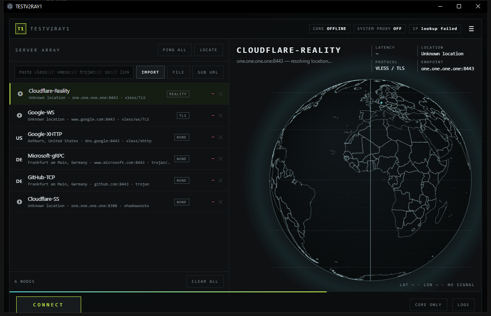
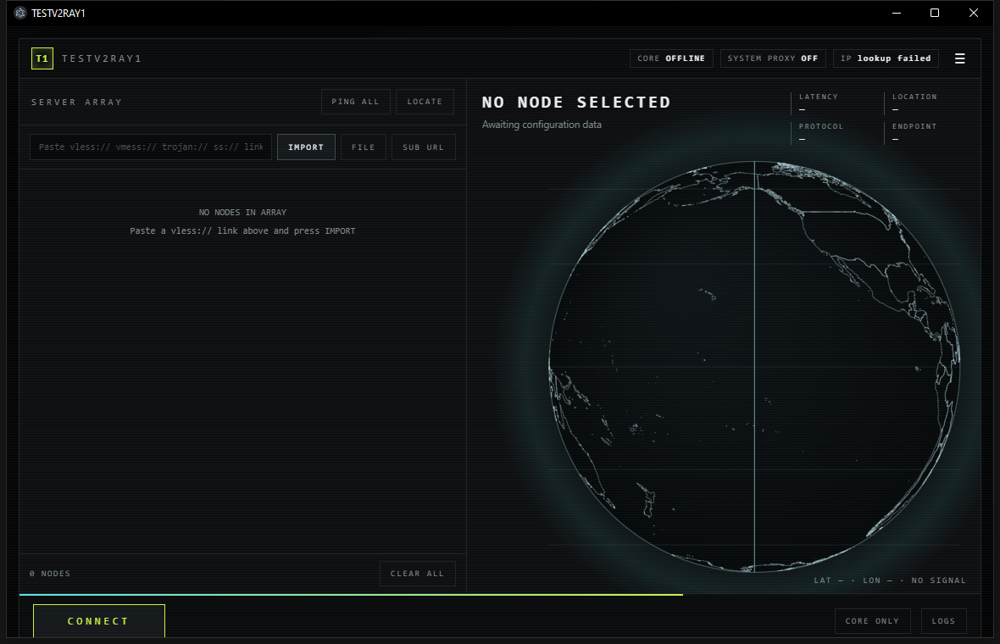

# TESTV2RAY1

Sci-fi xray desktop client for **Windows 10 / 11**.

Import your servers, watch them light up on a real wireframe globe, ping them,
then arm the tunnel so every app on the machine goes through the one you picked.



| Idle | Node detail |
|---|---|
|  | Hover any country to highlight and name it. The active node is ringed on the globe, and your egress IP is marked separately so it is never mistaken for the server. |

---

## What it does

| Feature | Detail |
|---|---|
| Import | `vless://` (incl. Reality + XTLS Vision), `vmess://`, `trojan://`, `ss://` — pasted, from a file, as a base64 subscription blob, or from a subscription URL |
| Location | Resolves each host, geolocates it, prints city / country, plots it on the globe |
| Globe | Real Earth: 241 country outlines from Natural Earth 50m, ~100k coastline points, orthographic projection. Drag to rotate, auto-rotates when idle |
| Ping | Real TCP handshake latency to the node's port, colour-coded, with optional lowest-latency auto-select |
| Connect | Starts the bundled xray core, verifies traffic actually flows, then sets the Windows system proxy |
| Egress proof | Shows the real exit IP and compares it against your direct IP, so "connected" cannot be a lie |

## Safety

The failure that matters with a proxy client is arming the system proxy against a
dead core: every app on the machine goes offline and nothing explains why. This
build refuses to do that.

1. The core is started and the port probed **before** the proxy is touched.
2. Real traffic is sent through it and the egress IP checked.
3. Only then is the system proxy armed. If any step fails, it rolls back and
   leaves your proxy off.
4. Your previous settings are backed up on connect and restored on disconnect,
   on quit, and **on the next start** if a previous run was killed.
5. Only one instance runs at a time; a second is refused rather than fighting
   over the ports.

The startup reaper only ever clears a proxy pointing at its own port, so a
VPN or v2rayN proxy you set yourself is left strictly alone.

## Transport support is detected, not assumed

The app runs `xray run -test` once per transport at startup and gates only what
the bundled core actually rejects. Version strings lie — Reality is present in
older cores despite what some documentation claims — so the binary is the only
trustworthy source. If the probe cannot finish, nothing is gated.

Three things upstream removed, each handled rather than left to fail silently:

- **Plain HTTP/2 transport** — removed and folded into XHTTP. Legacy `type=h2`
  links are rewritten to `xhttp` automatically.
- **`allowInsecure`** — removed. The value is parsed and kept for display, but
  deliberately not written to the config: dropping a verification bypass fails
  in the safe direction.
- **Loose UUID validation** — tightened. Invalid UUIDs are now rejected up front
  instead of failing mid-connection.

## Requirements

- Windows 10 or 11, 64-bit
- Nothing else. No installer, no Node.js, no `npm install`.

## Run

Double-click **`TESTV2RAY1-WIN10.exe`**, or `START.bat`.

## Build

This repository is the source. The shipped folder is a self-contained Electron
app; `resources/app/` is unpacked JavaScript you can edit and restart.

```
main.js                 Electron main: IPC, lifecycle, single-instance lock
preload.js              contextBridge API surface
lib/parse.js            share-link + subscription parser
lib/geo.js              DNS resolve, geolocation, TCP ping
lib/core.js             xray config generation + process supervision
lib/proxy.js            system proxy enable / back up / restore
lib/verify.js           proves the tunnel really carries traffic
lib/capabilities.js     asks the real core what it supports
renderer/app.js         UI logic, globe projection
renderer/countries.js   241 country outlines (generated, from Natural Earth 50m)
resources/core/         xray.exe + geoip.dat / geosite.dat  (not committed)
```

Binaries are not committed: the Electron runtime, the xray core and the geo
databases are all build output, and `renderer/countries.js` is generated from
Natural Earth by `tools/build-countries.js` in the parent project.

## Tests

```bash
node test-win10.js      # parsing, transport discovery, every transport validated
                        # against the real core, live traffic, crash safety, UI
node compat-probe.js    # what the core accepts, transport by transport
```

`test-win10.js` flips the real system proxy to a dead port to prove the crash
reaper works, then restores the original state before exiting.

## Ports

- HTTP `127.0.0.1:10809` — what the system proxy points at
- SOCKS5 `127.0.0.1:10808`

---

Built on Electron 31 and Xray 26.3.27. The application source is MIT licensed.
xray is a separate project with its own licence.